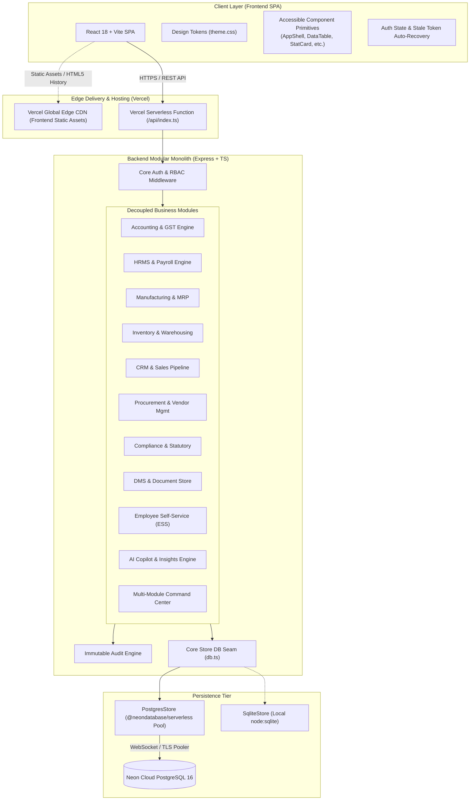
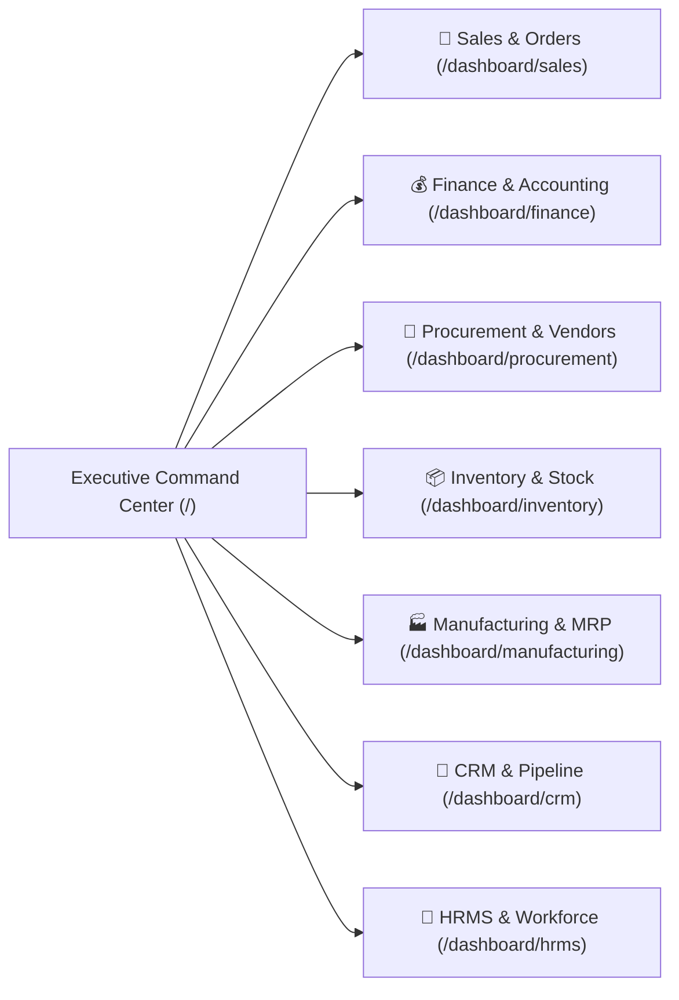
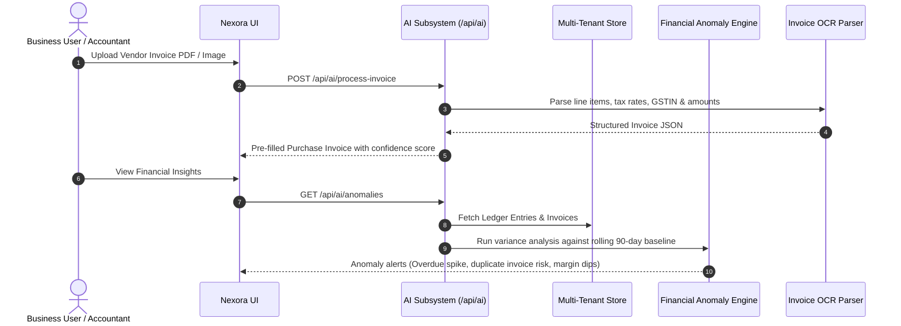

# Nexora AI-Native Business Operating Platform
## Technical & Architecture Design Document (TADD)

---

### Document Metadata
- **System**: Nexora AI-Native Business Operating Platform (ERP / BOPS)
- **Version**: 1.0.0 (Production Release)
- **Architecture Style**: Decoupled Modular Monolith + Cloud Serverless Edge API
- **Frontend Stack**: React 18, TypeScript, Vite, Tailwind CSS Design Token System
- **Backend Stack**: Node.js 22+, Express 4.19, TypeScript 5.5, `@neondatabase/serverless`
- **Database Engine**: PostgreSQL 16+ (Neon Cloud Serverless) / SQLite Seam (`node:sqlite`)
- **Hosting & Infrastructure**: Vercel Serverless Functions + Cloud PostgreSQL

---

## 1. Executive Summary & System Vision

Nexora is an **AI-Native Business Operating Platform** designed for high-growth enterprises and modern mid-market businesses. It unifies core enterprise resource planning (ERP) functions—**Finance & Accounting, HRMS & Payroll, Inventory & Supply Chain, Manufacturing (MRP), CRM & Pipeline, Procurement, Compliance & Statutory Filings, Document Management (DMS), and Employee Self-Service (ESS)**—into a single coherent, modular architecture powered by an embedded AI Copilot.

### Core Architectural Goals
1. **Modular Monolith Simplicity**: High cohesion within business modules and low coupling between modules, allowing independent feature velocity without distributed microservice overhead.
2. **Strict Multi-Tenant Isolation**: Hard multi-tenant boundary isolation across data storage, authentication tokens, and API requests.
3. **Pluggable Persistence Seam**: Abstracted `Store` interface enabling zero-dependency local development (SQLite via `node:sqlite`) and high-scale cloud execution (PostgreSQL with connection pooling).
4. **Resilient Serverless Cold-Start Execution**: Native compatibility with ephemeral serverless runtimes (Vercel Functions) with automated schema migration, resilient connection pooling, and cold-start seed race condition protection.
5. **AI-First Interaction**: Deeply embedded AI Copilot for autonomous invoice OCR parsing, automated financial anomaly detection, and natural language business intelligence.

---

## 2. High-Level Architecture Overview



---

## 3. Database Architecture & Multi-Tenancy

### 3.1 Persistence Seam (`Store` Interface)
The entire data access layer is abstracted behind a synchronous/asynchronous `Store` interface (`server/src/core/db.ts`). No business module directly issues raw SQL or vendor-specific queries; all operations pass through the unified `Store` API:

```typescript
export interface Store {
  collection(name: string): Promise<any[]>;
  seed(name: string, rows: any[]): Promise<void>;
  nextId(prefix: string, name: string): Promise<string>;
  all(tenantId: string, name: string): Promise<any[]>;
  byId(tenantId: string, name: string, id: string): Promise<any | undefined>;
  insert(tenantId: string, name: string, row: any): Promise<any>;
  update(tenantId: string, name: string, id: string, patch: any): Promise<any>;
  remove(tenantId: string, name: string, id: string): Promise<boolean>;
  query(tenantId: string, name: string, predicate: (row: any) => boolean): Promise<any[]>;
}
```

### 3.2 Dynamic Multi-Tenant JSON-Document Store Model
In PostgreSQL, each collection is backed by an indexed, multi-tenant JSON-document table created and maintained dynamically via `ensureTable()`:

```sql
CREATE TABLE IF NOT EXISTS "platform_users" (
  id TEXT PRIMARY KEY,
  "tenantId" TEXT NOT NULL DEFAULT '',
  data JSONB NOT NULL
);

CREATE INDEX IF NOT EXISTS "idx_platform_users_tenant" 
  ON "platform_users" ("tenantId");
```

#### Key Schema Benefits:
- **Flexible Document Schema**: Allows rapid evolution of business entities (e.g. adding custom fields to Sales Invoices or Employee records) without complex migration downtime.
- **Indexed Tenant Column**: High-performance partition-style index on `"tenantId"` ensures queries never scan rows belonging to other tenants.
- **Fast Key-Value Queries**: Primary keys (`id`) indexed directly in B-Tree index for $O(1)$ lookups.

### 3.3 Zero-Downtime Column Migration Engine
To support backward compatibility across different PostgreSQL deployments and legacy DDL schemas, `PostgresStore` incorporates an automatic in-engine schema migration block in `ensureTable()`:

```sql
DO $$
BEGIN
  -- Handle legacy lowercase unquoted column names
  IF EXISTS (SELECT 1 FROM information_schema.columns WHERE table_name = '${table}' AND column_name = 'tenantid') THEN
    ALTER TABLE "${table}" RENAME COLUMN "tenantid" TO "tenantid_old";
    ALTER TABLE "${table}" ALTER COLUMN "tenantid_old" DROP NOT NULL;
  END IF;
  IF EXISTS (SELECT 1 FROM information_schema.columns WHERE table_name = '${table}' AND column_name = 'tenant_id') THEN
    ALTER TABLE "${table}" RENAME COLUMN "tenant_id" TO "tenant_id_old";
    ALTER TABLE "${table}" ALTER COLUMN "tenant_id_old" DROP NOT NULL;
  END IF;
  IF NOT EXISTS (SELECT 1 FROM information_schema.columns WHERE table_name = '${table}' AND column_name = 'tenantId') THEN
    ALTER TABLE "${table}" ADD COLUMN "tenantId" TEXT NOT NULL DEFAULT '';
  END IF;
END $$;
```

---

## 4. Backend System Architecture

```
server/src/
├── core/                        # System Foundation Primitives
│   ├── db.ts                    # Persistence Seam & Backend Resolver
│   ├── db.postgres.ts           # PostgreSQL / Neon Serverless Adapter
│   ├── db.sqlite.ts             # Embedded SQLite Engine (Node 22.5+)
│   ├── auth.ts                  # Token Verification, RBAC & Context
│   ├── errors.ts                # Standardized ApiError Hierarchy
│   ├── audit.ts                 # Append-Only Audit Trail Logger
│   ├── http.ts                  # Async Handlers, Pagination, Assertions
│   └── types.ts                 # Global Platform Type Definitions
├── platform/                    # Cross-Cutting Core Services
│   ├── auth.routes.ts           # Authentication & Session Token API
│   ├── audit.routes.ts          # Audit Event Query & Compliance API
│   ├── notifications.routes.ts  # System Notification Dispatcher
│   ├── search.routes.ts         # Global Omnibox Search Engine
│   └── dashboard.routes.ts      # Multi-Module Aggregation Engine
└── modules/                     # Decoupled Business Domains
    ├── accounting.ts            # General Ledger, AR/AP, Invoicing, GST
    ├── hrms.ts                  # Employees, Attendance, Leave, Payroll
    ├── manufacturing.ts         # MRP, Bills of Material, Work Orders
    ├── inventory.ts             # Warehouses, Stock Adjustments, Bins
    ├── procurement.ts           # Vendor Rating, RFQs, Contracts, GRNs
    ├── crm.ts                   # Leads, Pipeline, Quotes, Sales Orders
    ├── projects.ts              # WBS, Timesheets, Project Budgets
    ├── quality.ts               # Inspection Plans, QC Checks, NC Logs
    ├── compliance.ts            # Statutory Filings, Deadlines, Evidence
    ├── dms.ts                   # Document Management & Versioning
    ├── ess.ts                   # Mobile Employee Self-Service API
    └── ai.ts                    # AI Copilot, Insights & Invoice OCR
```

### 4.1 Cross-Cutting Capabilities

#### 1. Role-Based Access Control (RBAC)
Authentication uses HMAC-signed compact JWT tokens (`nx1.<payload>`). Role-based authorization is enforced via declarative route middleware:
- `requireAuth`: Validates token signature and extracts tenant context (`req.user`).
- `requireRole(...roles)`: Verifies role membership before granting access to sensitive mutations (e.g. approving purchase invoices or running payroll).

```typescript
// Example: Financial transaction mutation restricted to Finance, Admin & Owner
router.post(
  '/sales-invoices', 
  requireAuth, 
  requireRole('finance', 'accountant', 'admin', 'owner'), 
  asyncHandler(async (req, res) => { ... })
);
```

#### 2. Immutable Audit Trail (`core/audit.ts`)
Every state mutation (Create, Update, Delete, Approve, Pay) automatically writes an append-only audit record:
- **Actor Context**: ID, Name, Role, IP Address
- **Action**: Action verb (`create`, `update`, `approve`, `reject`, `delete`)
- **Diff State**: Prior state (`oldState`) vs. mutated state (`newState`)
- **Module & Record Ref**: Exact reference to the affected document

---

## 5. Frontend Architecture & Design System

### 5.1 Design Token Architecture
Nexora UI follows a **Token-First Architecture** (`tokens/theme.css`). Colors, radiuses, shadows, and typography are defined as semantic CSS variables that resolve dynamically under light and dark modes:

| Semantic Token | Purpose | Light Value | Dark Value |
| :--- | :--- | :--- | :--- |
| `--nx-primary` | Main Brand Interaction | `#4F46E5` (Indigo 600) | `#6366F1` (Indigo 500) |
| `--nx-surface` | Card & Container Surfaces | `#FFFFFF` | `#1E293B` (Slate 800) |
| `--nx-canvas` | App Background Canvas | `#F8FAFC` (Slate 50) | `#0F172A` (Slate 900) |
| `--nx-ink` | Primary Typography | `#0F172A` | `#F8FAFC` |
| `--nx-ai` | Reserved AI Copilot Token | `#7C3AED` (Violet 600) | `#8B5CF6` (Violet 500) |

> [!IMPORTANT]
> **The Signature AI Token (`--nx-ai`)**:
> Violet is reserved strictly for AI-originated elements (`InsightCard`, Copilot buttons, AI badges). This visual guarantee ensures users immediately distinguish algorithmic recommendations from deterministic system data.

### 5.2 Component Hierarchy & Structure

```
frontend/src/
├── components/                  # Headless & Accessible Primitives
│   ├── AppShell.tsx             # Collapsible Navigation & Top Bar
│   ├── Button.tsx               # Primary / Secondary / Ghost / AI Buttons
│   ├── Card.tsx                 # Card, StatCard (KPI Tile), InsightCard
│   ├── DataTable.tsx            # Accessible, Controlled Multi-Column Table
│   ├── Input.tsx                # FormField, TextField, TextArea, Select
│   ├── Modal.tsx                # Accessible Dialog with Focus Trapping
│   ├── Toast.tsx                # Notification Toasts & Provider
│   ├── EmptyState.tsx           # Empty / Error State Indicator
│   ├── Skeleton.tsx             # Loading Skeletons for Layouts
│   ├── ThemeToggle.tsx          # Smooth Light/Dark Mode Switcher
│   └── charts/                  # Recharts Wrapper Components
├── pages/                       # Application Views
│   ├── auth/LoginPage.tsx       # Dedicated Login & Persona Selector
│   ├── dashboard/               # Command Center & Module Dashboards
│   ├── accounting/              # GL, Invoices, GST, Bank Accounts
│   ├── hrms/                    # Employees, Attendance, Payroll
│   ├── inventory/               # Stock Levels, Warehouses
│   ├── manufacturing/           # BOMs, Work Orders, MRP
│   ├── crm/                     # Leads, Customers, Sales Orders
│   ├── procurement/             # Vendors, Quotes, Contracts, GRNs
│   ├── projects/                # Projects, WBS, Timesheets
│   ├── quality/                 # QC Checks, Non-Conformances
│   ├── compliance/              # Filings & Deadline Calendar
│   ├── dms/                     # Documents & Version Tree
│   ├── ess/                     # Employee Self-Service Mobile View
│   └── ai/                      # Copilot, Anomalies, Invoice OCR
└── lib/                         # Client Utilities
    ├── api.ts                   # Type-Safe REST Client & Error Handling
    ├── theme.tsx                # Theme Context Provider
    └── utils.ts                 # Class Merging (cn) & Number Formatters
```

---

## 6. Multi-Module Operational Command Center

Nexora provides **7 Dedicated Module Dashboards** plus an executive **Command Center**:



### Dashboard Capability Matrix

| Dashboard | Key Metrics (KPIs) | Visualizations |
| :--- | :--- | :--- |
| **Command Center** | Total Revenue, Working Capital, Cash Position, AI Alerts | Multi-Line Revenue vs. Receivables, Low Stock Alerts |
| **Sales** | Revenue, AOV, Conversion Rate, Open Quotes, Churn | Status Donut, Monthly Revenue Bar, AR Pipeline |
| **Finance** | Gross/Net Margin, AR Aging (30/60/90+), Cash Flow, Payables | 5-Bucket AR Aging Bar Chart, Cash Inflow vs. Outflow |
| **Procurement** | Active Contracts, Spend Under Contract, Avg Lead Time, Rating | Spend by Category Donut, Lead Time Variance |
| **Inventory** | Total Stock Units, Turnover Rate, Stockout Risk, On-Time Delivery | Warehouse Distribution Bar Chart, Stock Movement Trend |
| **Manufacturing** | OEE %, Completed Orders, Units Produced, Capacity Utilization | Monthly Production Volume, OEE vs. Scrap Trend |
| **CRM** | Open Leads, Won Deals, CAC, Pipeline Value, Churn % | Lead Status Pipeline Donut, Sales Funnel Trajectory |
| **HRMS** | Active Headcount, Attendance Today, Turnover %, Revenue/Employee | Department Breakdown Donut, 5-Day Attendance Heatmap |

---

## 7. AI Copilot & Autonomous Subsystem

The AI subsystem (`/api/ai/*`) acts as an intelligent co-pilot across enterprise operations:



---

## 8. Deployment & Cloud Infrastructure

### 8.1 Serverless Pipeline Configuration (`vercel.json`)
The application deploys to Vercel as a unified full-stack monorepo:
- **Static Assets**: Compiled frontend bundle output to `frontend/dist`.
- **API Function**: Single root serverless entry point at `api/index.ts` capturing `/api/(.*)` and `/health`.

```json
{
  "version": 2,
  "buildCommand": "npm install --prefix server && npm install --prefix frontend && npm run build --prefix frontend",
  "outputDirectory": "frontend/dist",
  "functions": {
    "api/index.ts": {
      "includeFiles": "server/**"
    }
  },
  "routes": [
    { "src": "/api/(.*)", "dest": "/api/index.ts" },
    { "src": "/health", "dest": "/api/index.ts" },
    { "handle": "filesystem" },
    { "src": "/(.*)", "dest": "/index.html" }
  ]
}
```

### 8.2 Database Connection Pool Architecture
To prevent AWS Lambda / Vercel Serverless TLS disconnect errors, `PostgresStore` utilizes `@neondatabase/serverless` WebSocket/HTTP connection pooling when deployed against cloud PostgreSQL:

```typescript
const isNeon = connectionString.includes('neon.tech') || connectionString.includes('vercel-storage');

if (isNeon) {
  this.pool = new NeonPool({ connectionString });
} else {
  this.pool = new PgPool({
    connectionString,
    ssl: isLocalhost ? false : { rejectUnauthorized: false },
    max: 10,
    idleTimeoutMillis: 10000,
    connectionTimeoutMillis: 10000,
  });
}
```

---

## 9. Security, Compliance & Audit Readiness

### 9.1 Authentication Flow
1. User logs in via `POST /api/auth/login` with email and password.
2. System validates hashed credentials and retrieves tenant configuration.
3. System issues an HMAC-signed JWT containing principal identifiers (`id`, `tenantId`, `role`, `email`).
4. Client passes token in HTTP header: `Authorization: Bearer <token>`.
5. Every incoming API request validates token integrity and enforces tenant boundary filtering.

### 9.2 Statutory Tax & Reporting Compliance
- **Indian GST Engine**: Dual CGST + SGST (intra-state) and IGST (inter-state) calculation. Automatic GSTR-1 and GSTR-3B return summary generation.
- **TDS & Withholding**: Automatic deduction based on vendor category thresholds.
- **Statutory Payroll Compliance**: Automated PF (Provident Fund), ESI (Employee State Insurance), and Professional Tax (PT) deduction tables.
- **Quality & ISO 9001 Alignment**: Inspection plans, sampling checks, and non-conformance (NC) root-cause CAPA tracking.

---

## 10. Verification & Quality Assurance Matrix

| Layer | Verification Method | Status |
| :--- | :--- | :--- |
| **Server TypeScript Typecheck** | `npm run typecheck --prefix server` | **Passed (`tsc` 0 errors)** |
| **Frontend Production Build** | `npm run build --prefix frontend` | **Passed (`vite build` in 5.5s)** |
| **Live Database Connection** | GET `/health` (`cogni-nexora.vercel.app`) | **200 OK (`dbImpl: "postgres"`)** |
| **Live Authentication** | POST `/api/auth/login` | **200 OK (Issued valid JWT)** |
| **Live Multi-Module Dashboards** | GET `/api/dashboard/:module` (7 modules) | **200 OK on all 7 domains** |

---

*Authored by Antigravity Engineering Architecture Team*
