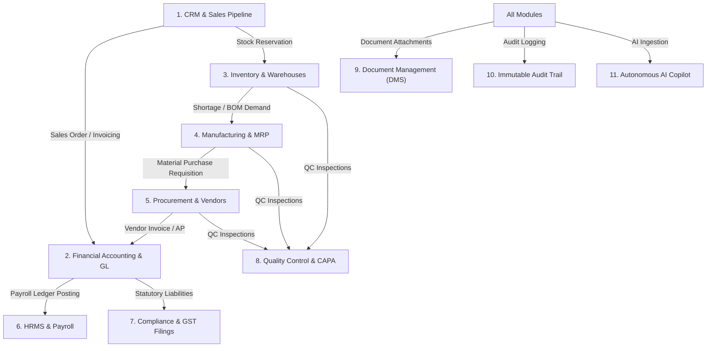
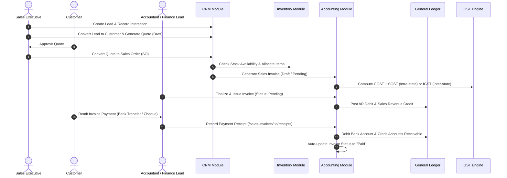
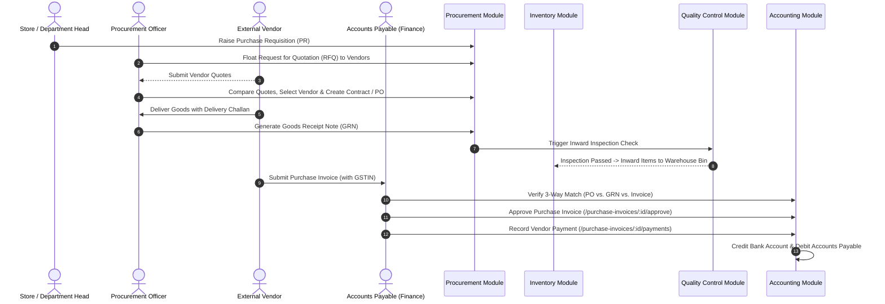
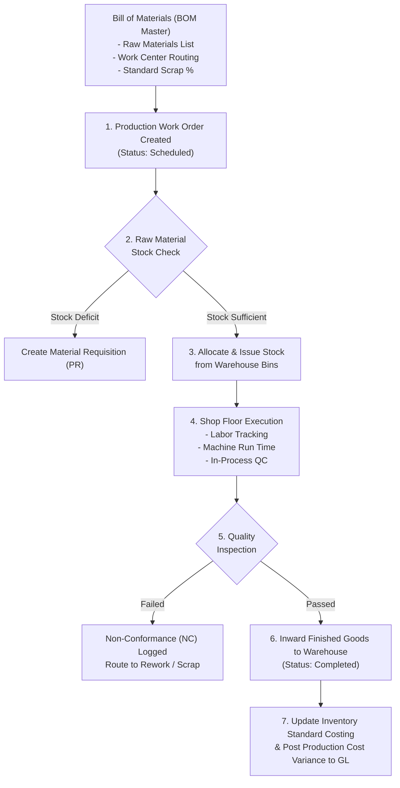
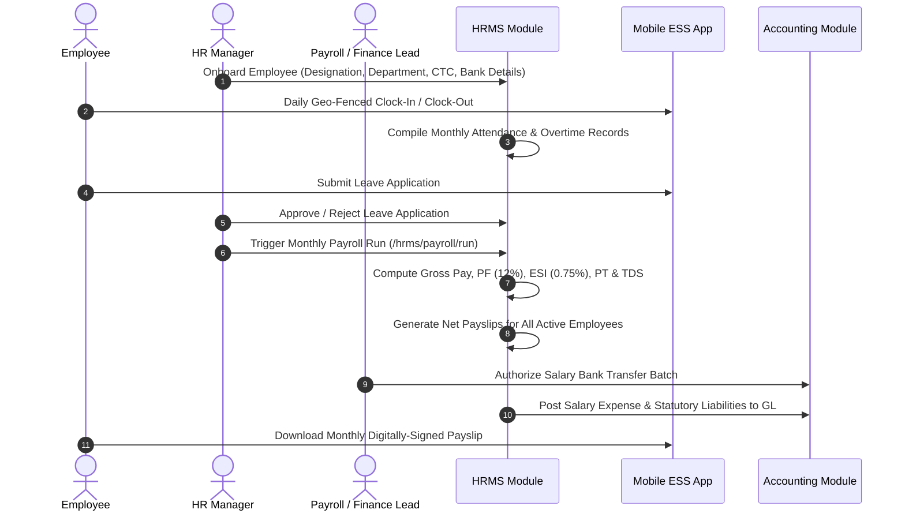
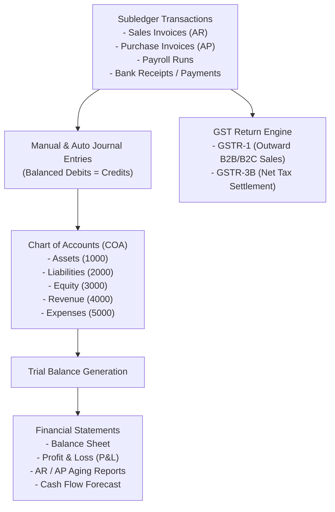
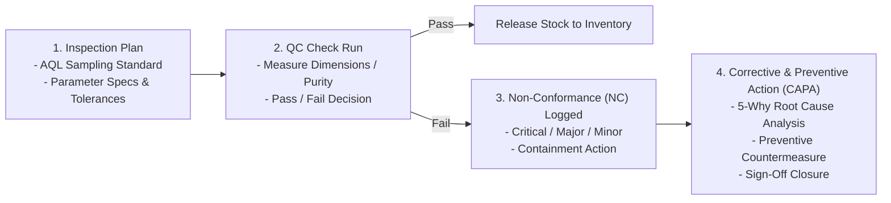

# Nexora AI-Native Business Operating Platform
## End-to-End Functional Flow & Process Design Document

---

### Document Metadata
- **System**: Nexora Enterprise Business Operating Platform (ERP / BOPS)
- **Version**: 1.0.0 (Production Release)
- **Scope**: Core End-to-End Functional Flows, Cross-Module Data Integration, and User Journeys

---

## 1. Functional System Overview

Nexora connects all enterprise operational domains through event-driven data flow and shared master records. A single transaction (e.g. fulfilling a Sales Order) automatically cascades across CRM, Inventory, Manufacturing, General Ledger, GST Returns, and Executive Analytics.

---

## 2. Core Business Process Flows

### 2.1 Order-to-Cash (O2C) Flow

The complete revenue generation cycle from initial lead prospecting to cash receipt reconciliation.

#### Key State Machine Transitions:
- **Lead**: `open` $\to$ `qualified` $\to$ `won` / `lost`
- **Quote**: `draft` $\to$ `sent` $\to$ `accepted` $\to$ `converted_to_so`
- **Sales Invoice**: `draft` $\to$ `pending` $\to$ `partially_paid` $\to$ `paid` / `overdue` / `cancelled`

---

### 2.2 Procure-to-Pay (P2P) Flow

The procurement cycle ensuring vendor governance, three-way matching, and payment execution.

#### Key State Machine Transitions:
- **Vendor Quote**: `draft` $\to$ `pending` $\to$ `accepted` / `rejected`
- **Contract**: `draft` $\to$ `active` $\to$ `expired` / `terminated`
- **Purchase Invoice**: `draft` $\to$ `approved` $\to$ `paid`

---

### 2.3 Plan-to-Produce (Manufacturing & MRP) Flow

The manufacturing execution workflow orchestrating raw materials, work centers, and bill of materials (BOM).

---

### 2.4 Hire-to-Retire (HRMS & Payroll) Flow

Employee lifecycle governance from onboarding and attendance tracking to monthly statutory payroll execution.

---

### 2.5 Record-to-Report (Financial Accounting & GST) Flow

General Ledger maintenance, double-entry consistency, and automated statutory tax return compilation.

---

### 2.6 Quality Control & CAPA (Inspect-to-CAPA)

Enterprise quality assurance across inbound materials, work-in-progress, and customer returns.

---

## 3. User Personas & Functional Journeys

| Persona | Role Key | Primary Responsibilities | Default Dashboard / Views |
| :--- | :--- | :--- | :--- |
| **Rajesh Kumar** | `owner` | Enterprise Strategy, Executive KPIs, Multi-Module Oversight | Command Center Slider, Global Audit Trail, Executive KPIs |
| **Priya Nair** | `finance` | General Ledger, Invoicing, Tax Returns, Cash Flow, Bank Rec | Finance Dashboard, Sales/Purchase Invoices, GST Returns |
| **Anita Sharma** | `hr` | Recruitment, Attendance, Leave Policies, Payroll Processing | HRMS Dashboard, Employee Master, Payroll Runs |
| **Karthik Reddy** | `manager` | Production Scheduling, MRP, Warehouse Stock, Dispatch | Manufacturing Dashboard, Inventory Dashboard |
| **Vikram Singh** | `employee` | Daily Attendance, Leave Requests, Expense Claims, Payslips | Employee Self-Service (ESS), Mobile View |

---

## 4. Cross-Module Event Interdependency Matrix

| Trigger Event | Source Module | Downstream Affected Modules | Automatic Actions Taken |
| :--- | :--- | :--- | :--- |
| **Sales Invoice Issued** | Accounting | General Ledger, GST, CRM, Analytics | Debits AR, Credits Revenue, Updates GSTR-1, Calculates Customer Outstanding |
| **Payment Receipt Recorded** | Accounting | General Ledger, Banking, CRM | Debits Bank, Credits AR, Flags Invoice as "Paid", Updates Cash KPI |
| **GRN Approved** | Procurement | Inventory, Quality Control | Triggers QC Inspection, Inwards Stock into Receiving Warehouse Bin |
| **Production Order Completed** | Manufacturing | Inventory, General Ledger | Deducts Raw Material Stock, Inwards Finished Goods, Updates Cost Valuation |
| **Payroll Run Finalized** | HRMS | General Ledger, Banking, ESS | Posts Salary Expense & Tax Withholdings, Generates Digital Payslips in ESS |
| **Vendor Invoice OCR Parsed** | AI Subsystem | Accounting, Procurement | Extracts Vendor GSTIN, Line Items, Tax Rates, Pre-populates Purchase Invoice |

---

*Authored by Antigravity Engineering Architecture Team*
