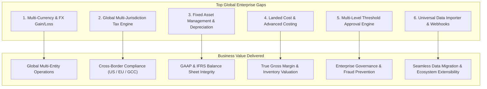
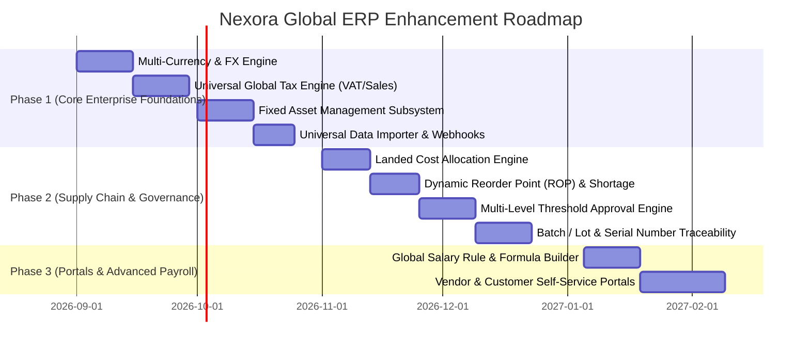

# Nexora AI-Native Business Operating Platform
## Global ERP Functionality Gap Analysis & Strategic Remediation Plan

---

### Executive Overview
This document evaluates the **Nexora AI-Native Platform** against Tier-1 and Tier-2 Global ERP standards (**SAP S/4HANA, Oracle NetSuite, Microsoft Dynamics 365, Odoo Enterprise**). It identifies functional, operational, and architectural gaps required for cross-border enterprise deployments and outlines a phased execution plan.

---

## 1. Global Benchmark Comparison & Gap Matrix

| ERP Functional Domain | Current Nexora Capability | Global ERP Benchmark (SAP / NetSuite / D365) | Gap Severity | Priority |
| :--- | :--- | :--- | :---: | :---: |
| **1. Multi-Currency & FX Engine** | Single functional currency (`INR`), static formatters | Real-time FX exchange rates, realized & unrealized FX gain/loss on settlements, multi-subsidiary reporting consolidation | **High** | **Phase 1** |
| **2. Global Multi-Tax Engine** | Indian GST (CGST/SGST/IGST) & TDS | Universal Tax Engine: VAT (UK/EU/GCC), US Sales & Use Tax (state/county), Withholding Tax, Canadian GST/PST/HST | **High** | **Phase 1** |
| **3. Fixed Asset Management** | Not implemented | Asset Master, Capitalization, Depreciation Engines (SLM, WDV, Double-Declining), Revaluation, Disposal/Write-off | **High** | **Phase 1** |
| **4. Landed Cost & Costing Engine** | Standard purchase price valuation | Landed Cost allocation (freight, customs, insurance across line items), FIFO/Moving Average/Standard Costing | **Medium** | **Phase 2** |
| **5. Supply Chain & Automated ROP** | Manual Stock Transfers & Adjustments | Dynamic Reorder Point ($ROP = \text{Lead Time Demand} + \text{Safety Stock}$), automated Purchase Requisition generation | **Medium** | **Phase 2** |
| **6. Batch / Lot & Serial Tracking** | Item-level stock counts | Batch/Lot creation, Serial number assignment, Expiry date tracking, FEFO picking, Quality recall trace | **Medium** | **Phase 2** |
| **7. Multi-Level Approval Workflows** | Single-click approve/reject | Threshold-based approval hierarchies (e.g. $<\$5k \to \$50k \to \$100k+$), parallel/sequential chains, delegation | **High** | **Phase 2** |
| **8. Global Payroll & Salary Rules** | Fixed Indian PF, ESI, PT formulas | Dynamic Formula Builder (`HRA = 40% * Basic`), multi-country tax templates (US W-2/FICA, UK PAYE, UAE WPS/Gratuity) | **Medium** | **Phase 3** |
| **9. External Customer & Vendor Portals** | Internal Employee ESS only | Vendor Self-Service (RFQ bidding, PO acknowledgment, invoice upload), Customer Portal (quote approval, payments) | **Medium** | **Phase 3** |
| **10. Enterprise Data Import & Webhooks** | JSON seed scripts & CSV export | Universal CSV/Excel Importer with field mapping & validation, Outbound Webhooks for third-party integrations | **Medium** | **Phase 1** |

---

## 2. Detailed Functional Gap Deep-Dive

---

### Gap 1: Multi-Currency & Realized/Unrealized FX Accounting
- **Problem**: Transactions assume a single functional currency (`INR`). Cross-border purchase/sales orders in USD, EUR, GBP, AED, or SGD cannot record exchange rate fluctuations between invoice date and payment date.
- **Remediation**:
  1. Add `CurrencyExchangeRate` master table storing daily/monthly currency pair rates.
  2. Enhance `SalesInvoice` and `PurchaseInvoice` with `currency`, `exchangeRate`, and `baseCurrencyAmount`.
  3. On payment settlement, calculate Realized FX Gain/Loss ($(\text{Payment Rate} - \text{Invoice Rate}) \times \text{Foreign Amount}$) and auto-post to GL Account `4900 - FX Gain/Loss`.

---

### Gap 2: Universal Global Tax Engine (VAT, Sales Tax, WHT)
- **Problem**: Tax logic is hardcoded to Indian GST (18%, 12%, 5%, 0%).
- **Remediation**:
  1. Implement a generic `TaxRate` and `TaxCategory` model.
  2. Support multiple tax schemes:
     - **VAT (Value Added Tax)**: Standard rate (e.g. 5% GCC, 20% UK), Reduced rate, Zero-rated, and Exempt.
     - **US Sales Tax**: State, County, and City combined percentage based on Ship-To address.
     - **Withholding Tax (WHT)**: Deductions at source for foreign vendor services.
  3. Dynamic invoice line item calculation supporting multiple tax components.

---

### Gap 3: Fixed Asset Management Subsystem
- **Problem**: Capital expenditures (machinery, IT equipment, vehicles, buildings) are treated as regular expenses without capitalized asset tracking or periodic depreciation.
- **Remediation**:
  1. Create `Asset` entity (Asset Tag, Serial, Category, Purchase Date, Cost, Useful Life, Salvage Value, Cost Center).
  2. Implement Depreciation Calculation Engine:
     - **Straight-Line Method (SLM)**: $(\text{Cost} - \text{Salvage}) / \text{Useful Life Months}$
     - **Written-Down Value (WDV)**: $\text{Book Value} \times \text{Depreciation Rate}$
  3. Automated Monthly Depreciation Run posting Debit Depreciation Expense (`5800`) and Credit Accumulated Depreciation (`1700`).

---

### Gap 4: Landed Cost Allocation
- **Problem**: Inventory valuation only captures vendor invoice price. Freight, customs duties, port handling, and clearing charges are expensed separately, distorting true gross margins.
- **Remediation**:
  1. Create `LandedCostVoucher` allowing procurement teams to link extra charges (freight, customs) to one or more Goods Receipt Notes (GRNs).
  2. Distribute charges across line items by **Value**, **Quantity**, or **Weight**.
  3. Recompute Item Standard Cost / Moving Average Cost and update inventory ledger.

---

### Gap 5: Multi-Level Threshold Approval Engine
- **Problem**: Transactions are approved in a single step without management threshold limits or escalation hierarchy.
- **Remediation**:
  1. Create `ApprovalPolicy` rules (e.g. PO Amount $> \$10,000 \to$ Department Manager $\to$ Finance Director $\to$ CFO).
  2. Support sequential approval stages (`pending_stage_1`, `pending_stage_2`, `approved`, `rejected`).
  3. Out-of-office delegation and notification alerts.

---

### Gap 6: Universal Data Importer & Outbound Webhooks
- **Problem**: Migrating existing ERP master data (Chart of Accounts, Opening Balances, Customers, Vendors, Item Catalog) requires manual seeding or direct DB writes.
- **Remediation**:
  1. Create generic CSV/Excel mapping UI with schema validation and error row highlighting.
  2. Implement Outbound Webhooks (`WebhookSubscription`) sending signed JSON payloads on entity lifecycle events (`invoice.created`, `payment.received`, `stock.low`).

---

## 3. Phased Implementation Roadmap

---

## 4. Immediate High-Impact Remediation Items (Phase 1 Action Plan)

To position Nexora for immediate global customer readiness, the following 4 modules will be implemented next:

1. **Fixed Asset Management Subsystem**:
   - Backend routes (`server/src/modules/assets.ts`): Asset Register, Depreciation Schedules, Disposal, Valuation.
   - Frontend pages (`frontend/src/pages/assets/`): Asset List, Asset Depreciation Calculator, Asset Cards.
2. **Multi-Currency & FX Rates**:
   - Currency Pair Master, Live Exchange Rate selector on Quotes/Invoices/POs, and FX Gain/Loss calculation on payment receipts.
3. **Universal Tax Configuration (VAT & Sales Tax)**:
   - Configurable Tax Profiles (VAT 5%, VAT 20%, US Sales Tax, Zero-Rated) toggleable in Tenant settings.
4. **Universal Data Importer**:
   - Drag-and-drop CSV/Excel importer with column mapping and instant validation for Masters (Accounts, Customers, Vendors, Items).

---

*Authored by Antigravity Engineering Architecture Team*
